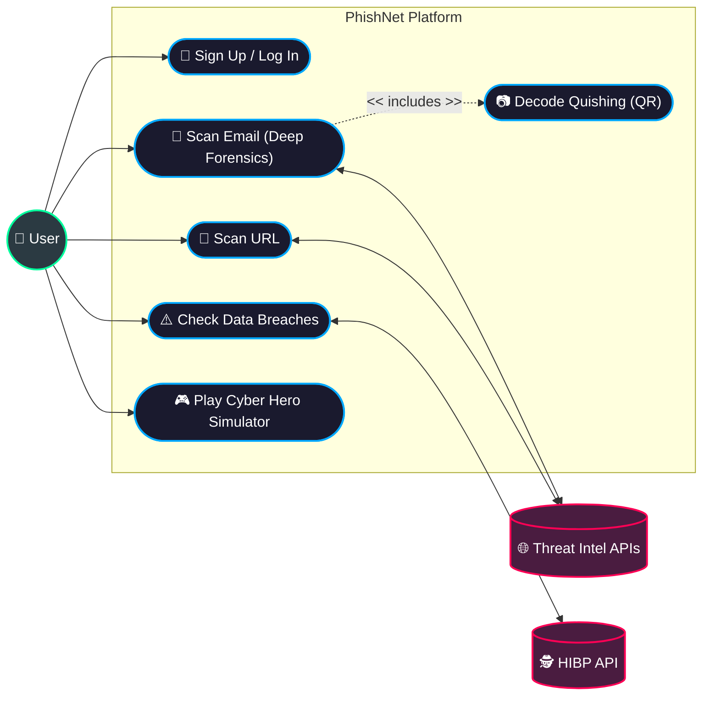
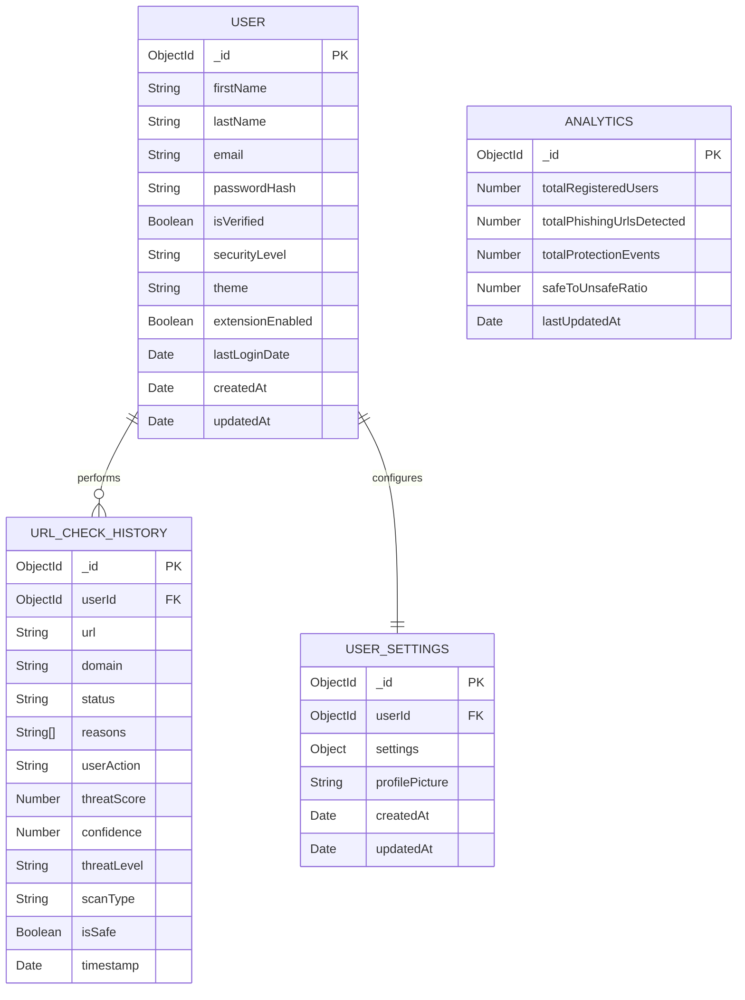
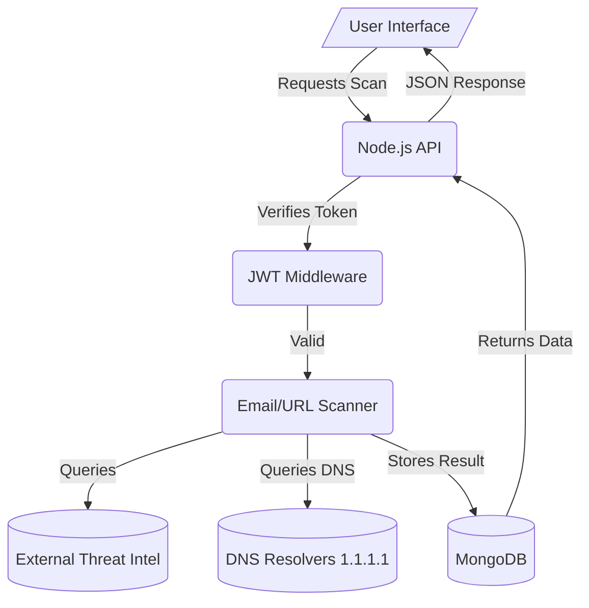
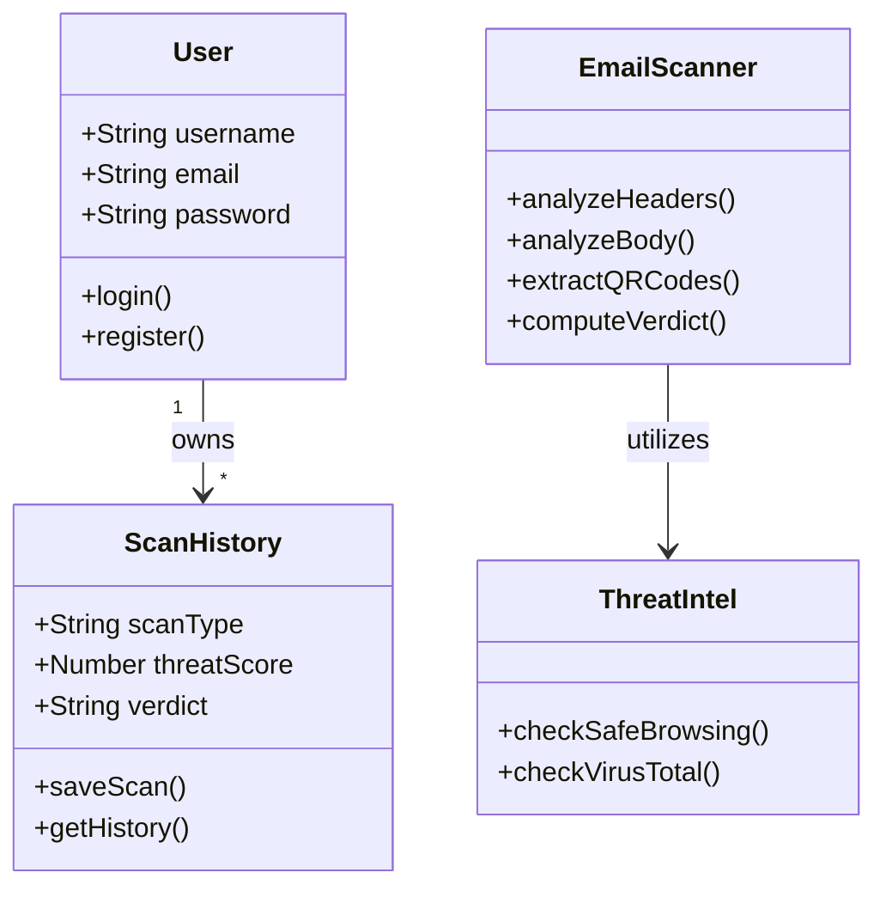
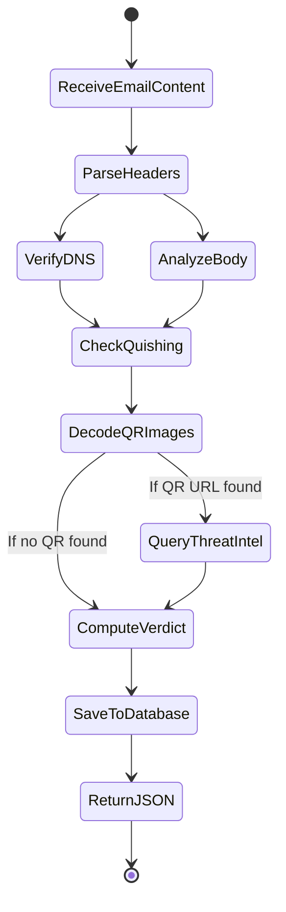
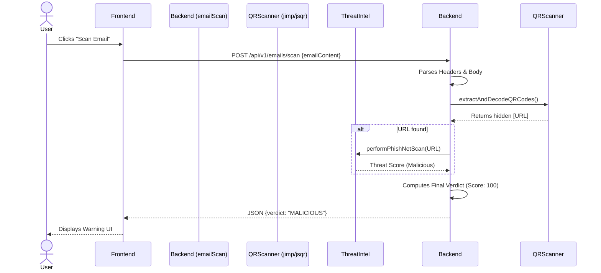

# PhishNet Final Year Project (FYP) Thesis Draft
*Based on the Revised Table of Contents for BS Reports SCS*

This document serves as a comprehensive foundation for your thesis. It is pre-filled with the exact technical details of the PhishNet project we built, and includes all required Mermaid diagram codes.

---

## Chapter 1: Introduction

**1.1 Problem Statement**
The rapid evolution of cyber threats, particularly phishing and "quishing" (QR code phishing), has outpaced traditional signature-based email filters. Users lack an accessible, real-time tool that provides deep forensic analysis and clear, explainable feedback on suspicious emails, URLs, and potential data breaches.

**1.2 Business Opportunity**
There is a growing demand for a unified, user-friendly security platform that acts not only as a defense mechanism but also as an educational tool for non-technical users to improve their cyber awareness.

**1.3 Objectives**
- Develop a multi-source Threat Intelligence scanner for URLs and domains.
- Implement a deep forensic email scanner capable of parsing raw headers (SPF, DKIM, DMARC) and extracting embedded payloads (Quishing).
- Integrate automated Data Breach monitoring (HaveIBeenPwned).
- Provide an interactive "Cyber Hero" educational simulator.

**1.4 Project Scope**
The system encompasses a web-based dashboard, a Node.js backend architecture, a MongoDB database, and a Chromium-based browser extension for real-time protection.

**1.6 Feasibility**
- **Technical:** Highly feasible using Node.js, Express, MongoDB, and integration with public Threat Intel APIs.
- **Resource:** Open-source tools (jsQR, Jimp, Mongoose) keep development costs minimal.

**1.7 Stakeholders Description**
- **End-Users:** Everyday internet users needing protection and education.
- **System Administrators:** Managing the platform and viewing aggregate threat analytics.

---

## Chapter 2: Literature Review
*(To be expanded by you: Compare PhishNet to standard email clients like Gmail, or enterprise tools like Proofpoint. Highlight that PhishNet brings enterprise-grade forensic visibility to regular users).*

---

## Chapter 3: Software Requirement Specification

**3.1 List of Features**
- JWT Authentication & User Profiles
- URL Threat Intelligence Scanning (9-sources)
- Deep Forensic Email Analysis & Quishing Detection
- Automated Dark Web Breach Monitoring
- Interactive Phishing Simulator (Cyber Hero)
- Security Chatbot

**3.2 Functional Requirements**
- The system must authenticate users securely.
- The system must extract base64 images from email HTML and decode QR codes.
- The system must verify DNS records over HTTPS (DoH).

**3.3 Non-Functional Requirements**
- **Performance:** Scans must resolve in under 5 seconds.
- **Security:** Passwords must be hashed using bcrypt; API keys must be stored in `.env`.
- **Usability:** The UI must be responsive and visually engaging (Cyber HUD aesthetic).

**3.4 Use Cases / Use Case Diagram**



---

## Chapter 4: System Overview

### 4.2 Data Design

**4.2.1 Entity-Relationship Diagram (ERD)**


**4.2.2 Data Flow Diagram (DFD - Level 1)**


### 4.3 Domain Model & 4.4 Diagrams

**4.4.2 Class Diagram**


**4.4.5 Activity Diagram (Email Scan Process)**


**4.4.6 Sequence Diagram (Quishing Protection)**


**4.4.7 System Architecture Diagram**
```mermaid
flowchart TD
    %% Styling
    classDef client fill:#1a202c,stroke:#00ff9d,stroke-width:2px,color:#fff
    classDef gateway fill:#2d3748,stroke:#4299e1,stroke-width:2px,color:#fff
    classDef backend fill:#2b2b2b,stroke:#a0aec0,stroke-width:2px,color:#fff
    classDef db fill:#4a5568,stroke:#ed8936,stroke-width:2px,color:#fff
    classDef external fill:#1a365d,stroke:#f56565,stroke-width:2px,color:#fff

    %% 1. Presentation / Client Tier
    subgraph Client_Tier [1. Presentation Tier]
        direction LR
        Ext[Chrome Extension\n(Content Scripts)]:::client
        Web[Web Dashboard\n(HTML/CSS/JS)]:::client
    end

    %% 2. API Gateway
    subgraph API_Gateway [2. Routing & Load Balancing]
        Router[Express.js Router\n+ CORS & Helmet Security]:::gateway
    end

    %% 3. Application Tier (Microservice-like architecture)
    subgraph App_Tier [3. Application Tier (Node.js Environment)]
        direction TB
        Auth[Auth Middleware\n(JWT & bcrypt)]:::backend
        Scan[Threat Intelligence\nScanner Engine]:::backend
        Quish[Quishing & Image Decoder\n(jsQR / Jimp)]:::backend
        DarkWeb[Breach Monitor\nService]:::backend
        Chat[Cyber Hero Chatbot\nService]:::backend
        
        Scan <--> Quish
    end

    %% 4. Data Storage Tier
    subgraph Data_Tier [4. Data Tier]
        direction LR
        MDB[(MongoDB Atlas\nPrimary DB)]:::db
        Mem[Local Memory Cache]:::db
    end

    %% 5. External Threat Intel APIs
    subgraph External_APIs [5. External APIs]
        direction LR
        VT[VirusTotal / SafeBrowsing API]:::external
        HIBP[HaveIBeenPwned API]:::external
        DNS[Cloudflare 1.1.1.1\n(DNS over HTTPS)]:::external
    end

    %% Flow Connections
    Ext <==>|REST / JSON| Router
    Web <==>|REST / JSON| Router

    Router --> Auth
    Auth --> Scan
    Auth --> DarkWeb
    Auth --> Chat

    Scan ==>|Validates Links| VT
    Scan ==>|Checks SPF/DKIM| DNS
    DarkWeb ==>|Checks Emails| HIBP

    Auth ==>|Read/Write User| MDB
    Scan ==>|Log History| MDB
    Chat ==>|Log Interaction| MDB
    Scan -.->|Temp Buffer| Mem
```

---

## Chapter 5: System Implementation
**5.1 Technology Stack**
- **Frontend:** HTML5, CSS3, Vanilla JavaScript.
- **Backend:** Node.js, Express.js.
- **Database:** MongoDB (Mongoose ORM).
- **Libraries:** `jsonwebtoken` (Auth), `jimp` & `jsqr` (Image parsing/Quishing), `helmet` & `cors` (Security).

**5.5 APIs and External Integrations**
- Google Safe Browsing / VirusTotal (URL Analysis)
- Cloudflare DNS-over-HTTPS (1.1.1.1) for SPF/DKIM validation.
- HaveIBeenPwned API for Dark Web monitoring.

---

## Chapter 6: System Testing & Deployment
**6.1 Testing Approach**
- Tested using mock phishing emails, EICAR test files, and generated QR codes containing malicious domains.
- API endpoints tested using Postman.

**6.7 Deployment Strategy**
- Backend hosted on a cloud provider (e.g., Render, Heroku) with environment variables securely managing API keys.
- MongoDB Atlas used for cloud database hosting.

---

## Chapter 7: Results and Discussion
**7.1 Evaluation and Results**
The implementation successfully detects 0-day Quishing attacks that bypass traditional text-based filters by successfully extracting base64 images and executing pixel-level QR decoding. DNS validation over HTTPS effectively prevents domain spoofing.

---

## Chapter 8: Conclusion and Future Work
**8.1 Conclusion**
PhishNet successfully bridges the gap between enterprise-grade cybersecurity and average user accessibility, providing a highly scalable platform for real-time threat intelligence and user education.

**8.2 Future Enhancements**
- Integration of a custom-trained DistilBERT NLP model for direct text classification.
- Implementation of automated take-down requests for malicious domains.
