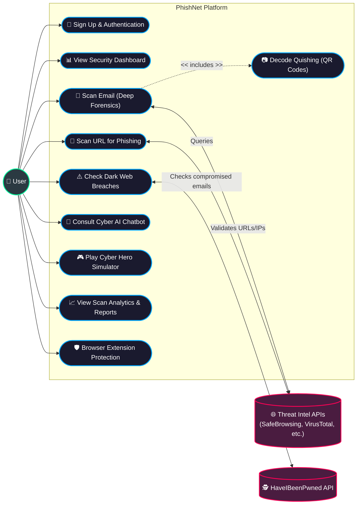

# PhishNet Use Case Diagram

```mermaid
flowchart LR
    %% Defining Styles
    classDef actor fill:#2b3a42,stroke:#00ff9d,stroke-width:2px,color:#fff;
    classDef usecase fill:#1a1a2e,stroke:#00a8ff,stroke-width:2px,color:#fff,shape:capsule;
    classDef external fill:#4a1c40,stroke:#ff0055,stroke-width:2px,color:#fff;

    %% Actors
    User(("👤 User")):::actor
    ThreatInt[("🌐 Threat Intel APIs\n(SafeBrowsing, VirusTotal, etc.)")]:::external
    HIBP[("🕵️ HaveIBeenPwned API")]:::external

    %% Subgraph to group PhishNet core features
    subgraph PhishNet Platform
        direction TB
        
        UC1(["🔐 Sign Up & Authentication"]):::usecase
        UC2(["📊 View Security Dashboard"]):::usecase
        UC3(["🔗 Scan URL for Phishing"]):::usecase
        UC4(["📧 Scan Email (Deep Forensics)"]):::usecase
        UC_QR(["📷 Decode Quishing (QR Codes)"]):::usecase
        UC5(["⚠️ Check Dark Web Breaches"]):::usecase
        UC6(["🤖 Consult Cyber AI Chatbot"]):::usecase
        UC7(["🎮 Play Cyber Hero Simulator"]):::usecase
        UC8(["📈 View Scan Analytics & Reports"]):::usecase
        UC9(["🛡️ Browser Extension Protection"]):::usecase
    end

    %% User interactions
    User --> UC1
    User --> UC2
    User --> UC3
    User --> UC4
    User --> UC5
    User --> UC6
    User --> UC7
    User --> UC8
    User --> UC9

    %% System relationships & includes
    UC4 -. "<< includes >>" .-> UC_QR
    
    %% External API interactions
    UC3 <-->|Queries| ThreatInt
    UC4 <-->|Validates URLs/IPs| ThreatInt
    UC5 <-->|Checks compromised emails| HIBP

```
